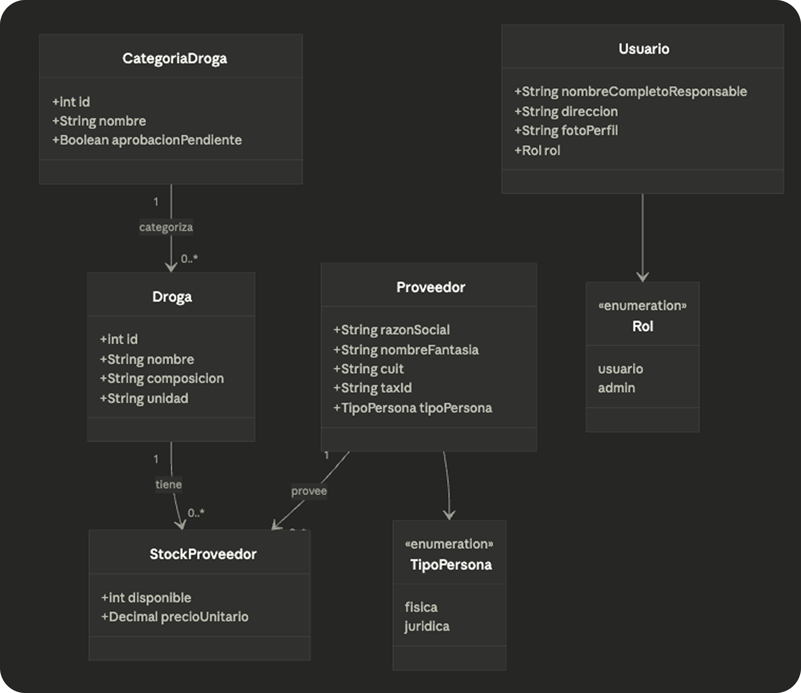
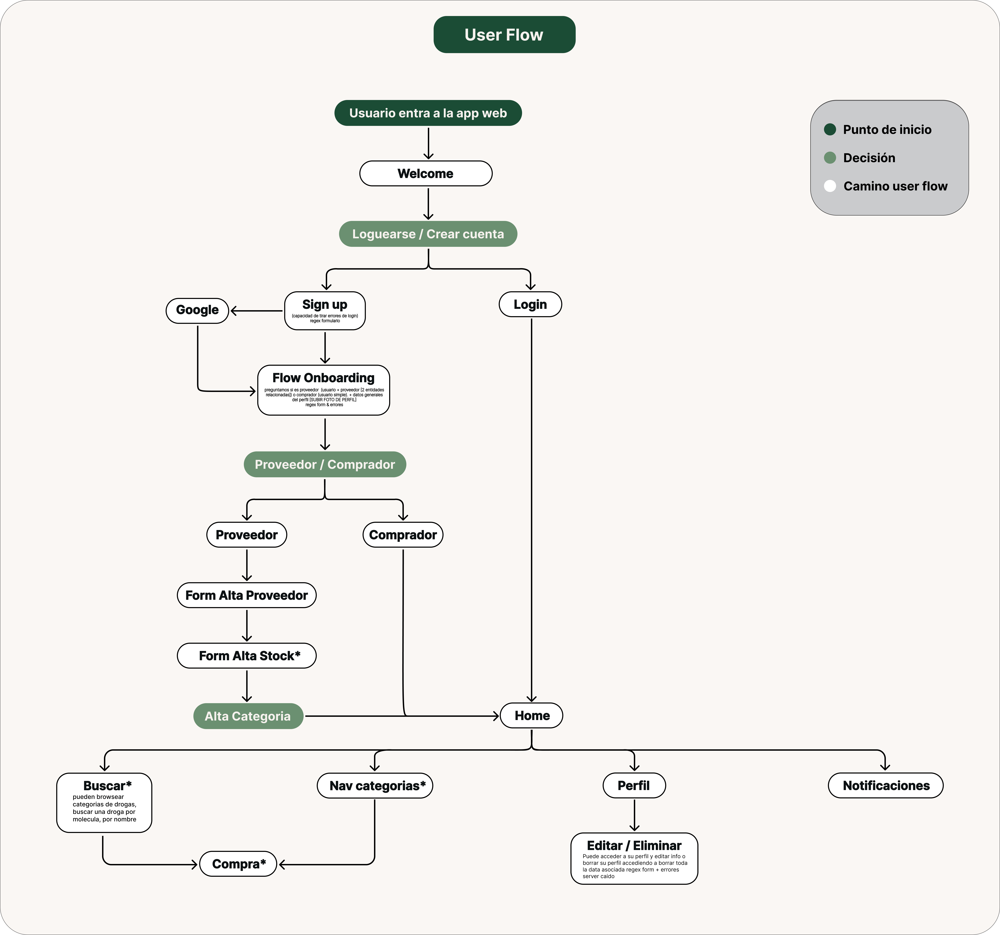

# FarmaLibre

## Propuesta de proyecto | Asignatura: Java | UTN Rosario | 2026

1. ## **Integrantes**

| Legajo | Apellido y nombres |
| :---- | :---- |
| 51881 | Palamidessi, Elias |
| 50977 | Pennice, Lucas |

---

2. ## **Descripción del sistema**

FarmaLibre es un sistema de e-commerce B2B especializado en la compraventa de productos farmacéuticos. La plataforma conecta a Proveedores (laboratorios y distribuidores) con Compradores (empresas o personas que adquieren medicamentos), bajo la supervisión de un rol Administrador que modera el catálogo y aprueba nuevas categorías de drogas.

El flujo principal permite a los proveedores registrar su stock con precios unitarios, mientras que los compradores pueden buscar medicamentos por categoría o nombre, realizar pedidos con cálculo automático de envío y gestionar su perfil. El sistema resuelve automáticamente el mix óptimo de proveedores cuando el stock de un solo proveedor no alcanza para cubrir la cantidad solicitada

3. ## **Modelo de dominio**

4. ## **Casos de uso para Regularidad**

| Requerimiento | User Story | Descripción breve |
| :---- | :---- | :---- |
| CRUD Simple | CRUD Drogas | Alta, baja, modificación y consulta de drogas del catálogo. |
|  | CRUD Categorías de Drogas | Gestión de categorías; alta queda pendiente de aprobación administrativa. |
| CRUD Dependiente | CRUD Stock Proveedor | El proveedor gestiona su stock por droga (depende de Droga y Proveedor). |
| User Story No-CRUD | Registro y Onboarding de Usuario | Sign-up con selección de rol (Proveedor/Comprador) y carga de perfil. |
| Listado Simple | Listado de Drogas por Categoría | Navegación del catálogo filtrando por categoría. |

---

5. ## **Casos de uso para Aprobación Directa**

Todos los CRUDs de regularidad más los siguientes requerimientos adicionales:

| Requerimiento AD | User Story | Descripción breve |
| :---- | :---- | :---- |
| User Story Complejo (nivel resumen) | Proceso de Compra con Mix de Proveedores  | Checkout que calcula mix óptimo entre proveedores, gestiona stock y calcula |
| Listado Complejo | Búsqueda de Drogas (por nombre / molécula) | Listado con filtros, precios comparados y disponibilidad por proveedor. |
|  | Gestión de Perfil (Editar / Eliminar) | El usuario edita o elimina su cuenta y datos asociados. |
| Nivel de Acceso | Roles: Admin / Proveedor / Comprador | Acceso diferenciado por rol: el admin aprueba categorías y modera publicacio |

---

6. ## **User flow**

7. ## **Stack Tecnológico**

| Capa | Tecnología |
| :---- | :---- |
| Backend | Java 21 · Servlets · Tomcat 11 |
| Frontend | JSP · HTML · CSS · JavaScript |
| Base de Datos | MySQL |
| Build | Maven |
